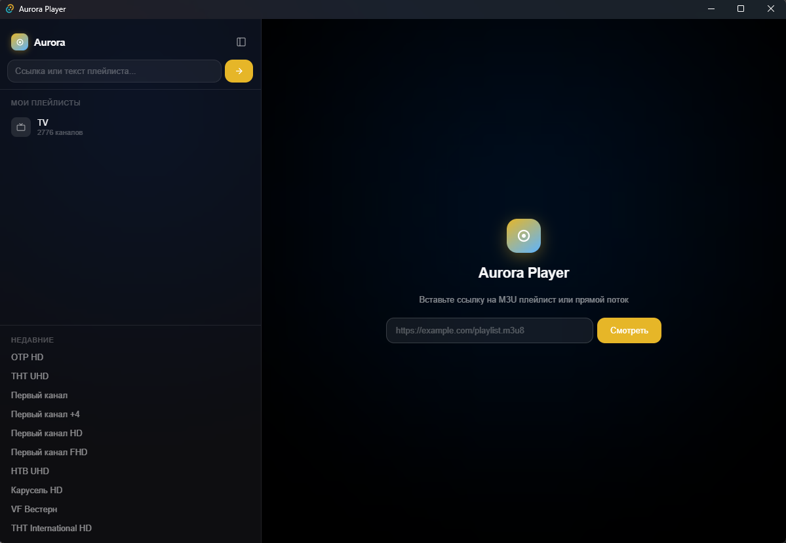

# ◉ Aurora Player

A native IPTV player for Windows with a minimalist interface.  
Rust + Tauri + React + hls.js.

Russian version: [docs/README.ru.md](docs/README.ru.md).



## Features

- **Automatic detection** — paste an M3U playlist link (loads every channel) or a direct stream link (creates a single channel)
- **M3U parsing** — pulls the channel name, logo (`tvg-logo`) and group (`group-title`) out of the playlist
- **Playback** — HLS (`.m3u8`) through hls.js, with a fallback to inserting the URL directly
- **Groups** — filter channels by the groups defined in the playlist
- **Search** — quick search across channel names
- **Favourites** — ★ add channels to favourites
- **History** — the last 20 channels watched
- **Autosave** — playlists are kept in localStorage and survive a restart
- **Bilingual interface** — English by default, Russian one click away in the settings

## Installation

### Prebuilt binary

```
aurora-player\src-tauri\target\release\aurora-player.exe
```

Or the installer:

```
aurora-player\src-tauri\target\release\bundle\nsis\Aurora Player_0.1.0_x64-setup.exe
```

### Building from source

```bash
cd aurora-player
npm run tauri build
```

### Development mode

```bash
npm run tauri dev
```

## Technologies

| Layer | Technology |
|------|-----------|
| Window | Tauri 2 + WebView2 |
| Backend | Rust (reqwest, serde) |
| Frontend | React 19 + TypeScript |
| Build | Vite |
| Video | hls.js + HTML5 Video |

## License

MIT LICENSE
